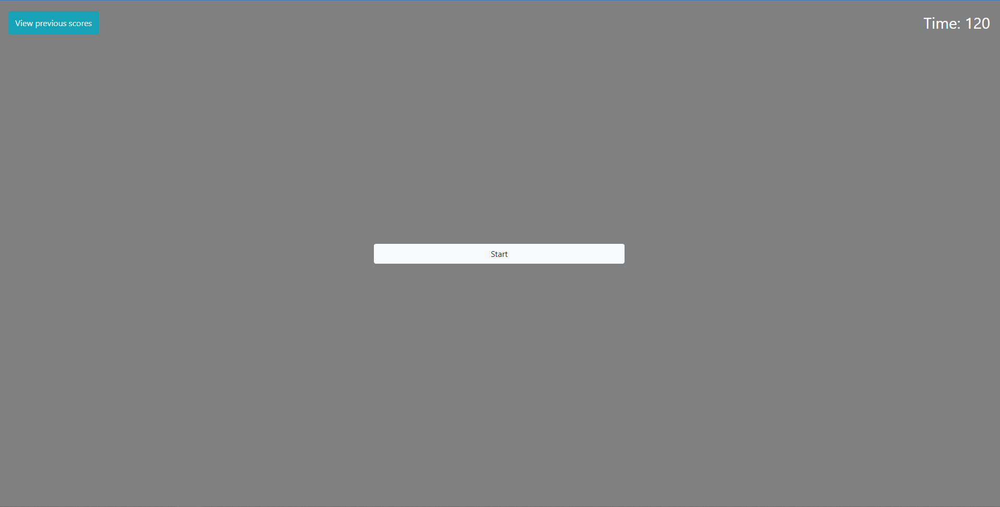

# Code Quiz
## Description
### This is a quiz that demonstrates my ability to create a countdown timer, make sure all functionality of buttons interconnect, and careful consideration of prompting the user. The quiz will prompt the user with 4 questions, and upon answering the correct question, the score will go up. You have the ability to save your score and retake the quiz and see all your previous scores at the end of the quiz.

## Screenshot
### 

## Link
### https://kyaeror.github.io/Coding-Quiz/